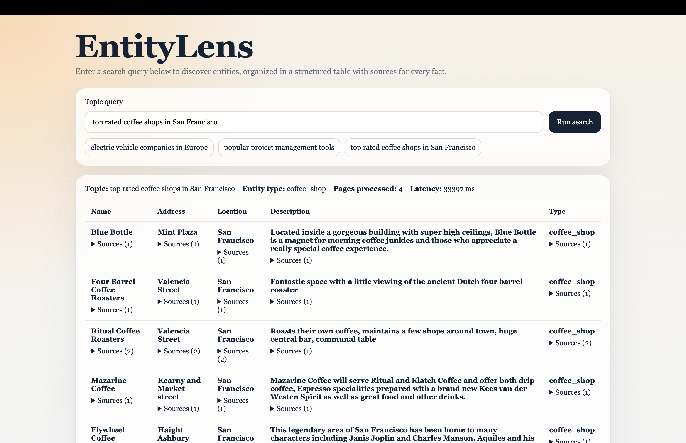

# EntityLens

**Live demo:** [agentic-entity-search.onrender.com](https://agentic-entity-search.onrender.com/)
**NOTE:** Free tier, may take ~30s to wake up on first visit; searches take 1-2 minutes on free-tier LLMs and have to retry sometimes. Much faster and reliable on local. 

Sample output:


An agentic entity search engine that accepts a natural language topic, searches the web, scrapes result pages, uses an LLM to extract structured entities, and returns a table where every cell includes source evidence with links back to the original page.

Try querying things like **"electric vehicle companies in Europe"**, **"top 5 vegetarian restaurants in Amherst"**, or **"popular project management tools"**.

## What makes this interesting

- **Two-phase schema inference.** Entity type is inferred before searching (so we know *what* to look for), but table columns are inferred *after* scraping (so columns reflect what the data actually contains, not what we guessed).
- **Data-driven column pruning.** Columns where more than 50% of rows are null are automatically removed from the final table, keeping results clean.
- **User count extraction.** "Top 3 books on AI" returns exactly 3 results. The LLM parses the requested count from natural language and caps the pipeline accordingly.
- **Entity-type-aware query planning.** If you search "vegetarian places in Amherst" and the entity type resolves to "restaurant," the search queries use "restaurant" instead of "places" for better results.
- **Simplified extraction prompt.** The LLM returns plain string values per column instead of nested source objects. Source metadata (URL, title, snippet) is attached in code from the page object. This cuts output tokens by ~70% and reduces per-chunk latency from 30+ seconds to 2-5 seconds.
- **Shared rate-limit coordination.** All five LLM call sites (entity type inference, column inference, query planning, extraction, reflection) use a single shared throttle (2s minimum gap) with exponential backoff retry on 429s, preventing rate-limit failures on free-tier APIs.
- **Null-string filtering.** LLM responses like `"null"`, `"n/a"`, and `"unknown"` are treated as null values, not displayed as text.
- **Early-exit heuristic.** The pipeline skips the costly reflection step if results already have 3+ entities with 30%+ cells filled, saving an LLM call and a full iteration.
- **Per-cell source attribution.** Every value in the results table links back to the specific page and text snippet that supports it.
- **Real-time SSE streaming.** The client shows live pipeline progress (searching, scraping, extracting, deduplicating) as each step completes.
- **Input validation.** Non-research inputs like "hello" or empty queries are rejected at both client and server, with the server combining validation into the entity-type inference call to avoid an extra LLM round trip.
- **Deterministic output.** All five LLM calls use temperature 0 for consistent entity extraction. The same page text always produces the same entities, eliminating LLM-side randomness. Run-to-run variation only comes from search result differences, which is expected.
- **Conversational query support.** The entity type prompt accepts natural phrasing like "I'm in Bangalore, what are popular spots?" instead of requiring formal queries. It only rejects pure greetings and gibberish.

## Architecture

```
Client (React + Vite, port 5173)
  |
  | POST /api/search/stream (SSE)
  v
Server (Express, port 4000)
  |
  v
Pipeline (up to 2 iterations):
  1. inferEntityType()    -- validate topic, detect entity type, extract requested count
  2. buildQueryPlan()     -- LLM generates 4-5 diverse, entity-type-aware search queries
  3. searchWeb()          -- run queries via Tavily (or Brave), deduplicate by URL
  4. scrapeSearchResults() -- fetch pages, extract text via Readability + Cheerio fallback
  5. inferColumns()       -- LLM picks 5-8 table columns from actual page content
  6. extractEntities()    -- chunk pages, send to LLM, parse structured entities
  7. resolveEntities()    -- deduplicate by normalized name/website, merge sources
  8. reflectOnResults()   -- LLM evaluates coverage, may suggest follow-up queries
  |
  v
Column pruning (drop columns >50% null) -> Final result
```

### Key design constants

| Constant | Value | Purpose |
|----------|-------|---------|
| `MAX_AGENT_ITERATIONS` | 2 | Max search-extract-reflect loops |
| `NULL_COLUMN_THRESHOLD` | 0.5 | Columns with >50% null rows are pruned |
| `THROTTLE_MS` | 2000 | Minimum gap between any two LLM calls |
| `DEFAULT_CHUNK_SIZE` | 4000 chars | ~1000 tokens per chunk |
| `MAX_CHUNKS` | 3 | Max chunks sent to LLM per iteration |
| `max_tokens` | 2048 | Cap on LLM output to prevent runaway generation |
| `temperature` | 0 | All LLM calls use deterministic output |
| `Scrape concurrency` | 4 | Max concurrent page fetches |
| `Content cap` | 12000 chars | Max scraped text per page |
| `Retry` | 4 attempts | Exponential backoff on 429 rate limits |

## Project structure

```
agentic-entity-search/
  package.json              # monorepo root (npm workspaces)
  .env.example              # environment variable template
  server/
    package.json
    src/
      index.js              # server entry point
      app.js                # Express app factory (CORS, routes, error handler)
      config.js             # env loading, provider auto-detection
      routes/
        search.js           # POST /api/search/stream (SSE), Zod validation
      services/
        searchPipeline.js   # orchestrates the full pipeline (batch + SSE modes)
        schemaBuilder.js    # two-phase schema: inferEntityType + inferColumns
        queryPlanner.js     # LLM-driven search query generation
        searchProvider.js   # Tavily / Brave search abstraction
        webScraper.js       # Readability + Cheerio page scraping
        chunker.js          # text chunking with sentence-boundary splitting
        entityExtractor.js  # LLM extraction with simplified prompt
        entityResolver.js   # deduplication by name/website, source merging
        reflector.js        # LLM reflection for follow-up queries
      utils/
        httpError.js        # HTTP error class with status codes
        llmThrottle.js      # shared 2s throttle across all LLM calls
        retryWithBackoff.js # exponential backoff on 429 responses
  client/
    index.html
    package.json
    vite.config.js
    src/
      main.jsx              # React entry point
      App.jsx               # search form, SSE streaming, state management
      styles.css            # full application styles
      components/
        ResultsTable.jsx    # entity table with per-cell source attribution
        AgentProgress.jsx   # live pipeline step indicators
      lib/
        api.js              # SSE client (POST-based, manual stream parsing)
```

## Setup

### Prerequisites

- Node.js 18+ (tested with Node 25)
- A Tavily API key (free tier)
- One LLM API key (Groq)

### 1. Clone and install

```bash
git clone https://github.com/smitha16/agentic-entity-search.git
cd agentic-entity-search
npm install
```

### 2. Configure environment

Copy the template and fill in your keys:

```bash
cp .env.example .env
```

Edit `.env` with your API keys (see sections below for how to obtain them).

### 3. Run

```bash
npm run dev
```

This starts both the server (port 4000) and the Vite dev client (port 5173). Open `http://localhost:5173` in your browser.

## Obtaining API keys

### Search API: Tavily (recommended, free tier)

1. Go to [tavily.com](https://tavily.com) and create an account.
2. Open the dashboard and generate an API key.
3. Set in `.env`:

```bash
SEARCH_PROVIDER=tavily
TAVILY_API_KEY=your_tavily_key
```

### LLM: Groq (recommended, fast free tier)

1. Go to [console.groq.com](https://console.groq.com) and create an account.
2. Navigate to API Keys and create a new key.
3. Set in `.env`:

```bash
GROQ_API_KEY=your_groq_key
```

The app auto-detects Groq and uses `llama-3.3-70b-versatile` by default.

### LLM: OpenRouter (many models, some free)

1. Go to [openrouter.ai](https://openrouter.ai) and create an account.
2. Navigate to Keys and create a new key.
3. Set in `.env`:

```bash
LLM_PROVIDER=openai-compatible
LLM_API_KEY=your_openrouter_key
LLM_BASE_URL=https://openrouter.ai/api/v1
LLM_MODEL=qwen/qwen-2.5-72b-instruct
```

### Provider auto-detection

If `LLM_PROVIDER` is not set, the app auto-detects based on which API key is present in this priority order: Gemini > Groq > OpenAI > OpenRouter.

## Design decisions and trade-offs

### Two-phase schema inference vs. one-shot
Inferring columns before searching would force guessing what data is available. By scraping first and then asking the LLM to pick columns from actual content, the table reflects reality. The trade-off is one extra LLM call, but it runs only once and the results are cached.

### Simplified extraction prompt
The original approach asked the LLM to return `{ value, sources: [{ url, title, snippet }] }` for every cell. Since we scrape one page at a time, we already know the source URL, title, and text. Asking the LLM to echo all of that back wastes output tokens and makes each call 30+ seconds on free-tier models. The simplified prompt returns plain strings (e.g. `"Tesla"` instead of `{ value: "Tesla", sources: [...] }`) and source metadata is attached in code.

### Shared throttle vs. per-service throttle
All LLM calls share a single 2s throttle instead of each service having its own timers. This prevents overlapping calls from different pipeline stages from hitting rate limits. It adds some latency sequentially, but eliminates 429 failures that would cost more time via retries.

### Temperature 0 everywhere
For entity extraction, deterministic output is preferable to creative variation. Temperature 0 ensures the same page text extracts the same entities consistently. The remaining run-to-run variation comes from search results, which is expected.

### Column pruning at 50%
Sparse columns add visual noise without value. Pruning columns that are >50% null keeps the table actionable. The `name` column is always preserved.

### Early-exit from reflection
The reflection LLM call itself takes several seconds. If the first iteration already produced 3+ entities with 30%+ cells filled, we skip reflection entirely. This saves time on queries that work well on the first pass.

### Chunk size 4000 characters
Smaller chunks mean faster LLM responses (fewer input tokens, fewer entities to extract per call). With `MAX_CHUNKS = 3`, we still cover multiple pages but keep total extraction time under a minute.

### SSE over WebSocket
SSE is simpler for this use case (server pushes progress to a single client). The client uses a manual `ReadableStream` parser instead of the `EventSource` API because `EventSource` only supports GET requests, and the search endpoint needs POST with a JSON body.

## Known limitations

- **No geolocation.** Queries like "restaurants near me" return generic results. Users must specify a location explicitly (e.g. "restaurants in Amherst").
- **Free-tier rate limits.** On Groq/Gemini free tiers, rapid successive queries may still hit rate limits despite the shared throttle. The retry mechanism handles this, but it adds latency.
- **Result variability.** Even with temperature 0, results can vary between runs because the search API (Tavily/Brave) returns different results based on real-time indexing.
- **No caching.** Search results and scraped pages are not cached between requests. The same query re-scrapes everything.
- **Limited to text pages.** PDFs, images, and JavaScript-rendered SPAs are not scraped. The scraper relies on server-rendered HTML.
- **Entity deduplication is heuristic.** Dedup uses normalized names and website hostnames. Entities referred to by different names across pages (e.g. "VW" vs. "Volkswagen AG") may not be merged.
- **Column inference is single-shot.** Columns are inferred once on the first iteration. If follow-up queries surface different types of information, the columns cannot adapt.
- **Max 25 entities.** The `requestedCount` is capped at 25 to keep response sizes manageable.
- **Slow on search render.** The searches take 1-2 minutes due to LLM rate limits and throttling.

## Tech stack

| Layer | Technology |
|-------|-----------|
| Server | Node.js, Express |
| Client | React, Vite |
| LLM | OpenAI-compatible SDK (Groq, Gemini, OpenAI, OpenRouter) |
| Search | Tavily API, Brave Search API |
| Scraping | Mozilla Readability, Cheerio, JSDOM |
| Validation | Zod |
| Streaming | Server-Sent Events (SSE) |
| Concurrency | p-limit |
